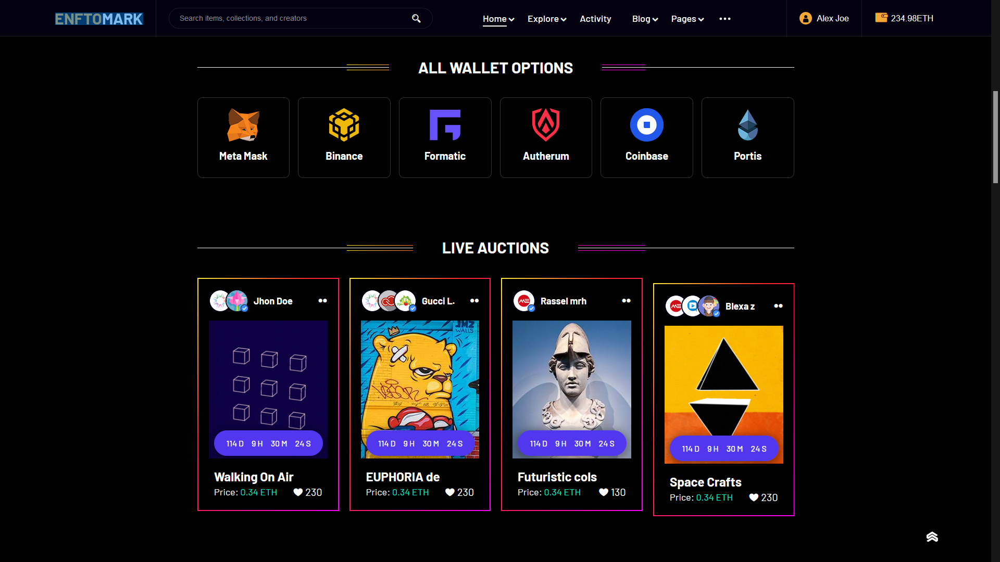

<h3 align="center">
  Enftomark Theme
</h3>

<!-- Typing SVG by DenverCoder1 - https://github.com/DenverCoder1/readme-typing-svg -->

  

 

This is Enftomark theme. JUst the basic HTML,CSS & JS version. It's not react ready. Will have react ready soon.

##### ⚠️This repository is just to support those who can't afford to buy the original one from theme-forest. So please don't use this if you can afford to buy.

#### ☠️It is not a good idea to use crack theme with big projects.

